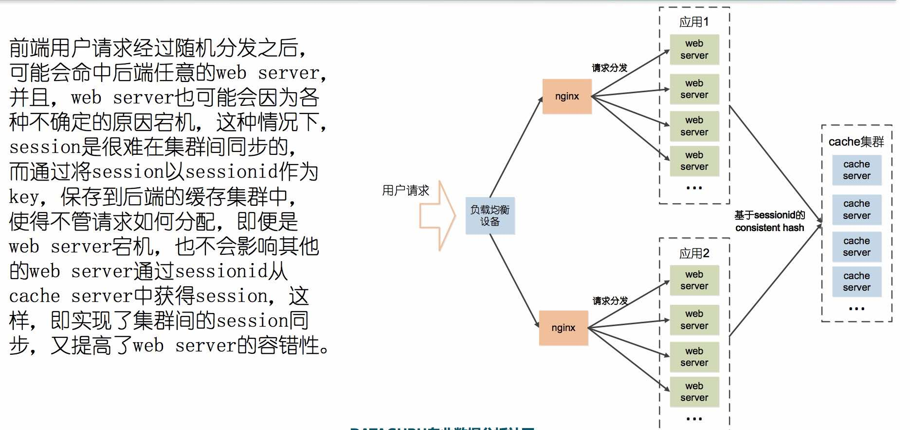

## 架构演进：
* 单一应用架构 => 垂直应用架构
* 垂直 => 分布式 (SOA)

分布式系统所依赖的基础设施包括服务框架、消息中间件、数据访问中间件、配置中心、分布式缓存系统、持久化存储(关系数据库、nosql数据库)、搜索引擎、CDN网络、负载均衡系统、运维自动化系统、硬件虚拟化及镜像管理系统、分布式文件系统、日志收集系统、监控系统、离线计算、实时计算、数据仓库等等。

Source code: <https://github.com/prince6635/distributedwebapp>

### SOA
* RPC － RPC的实现包括客户端和服务端，即服务的调用方以及服务的提供方，服务调用方发送RPC请求到服务提供方，服务提供方根据调用方提供的参数执行请求方法，将执行结果返回给调用方，一次RPC调用完成。
	* TCP协议实现：高性能，高并发
	* HTTP协议：跨平台
	* Examples:
		* 01_ImplementProtocolBySocket: understand how socket works
		* 01_SerializationMethods: different serilization/deserialization methods
		* 01_ImplementRPCByTCP: use TCP to implement RPC
		* 01_ImplementRPCByHTTP: use HTTP to implement RPC
		* 01_ImplementRPCByRESTfulHTTP: use RESTful HTTP to implement RPC
* 服务路由 － service discovery
	* 服务负载均衡
		* 单个服务的负载均衡：ngix，LVS
		* 多个服务点负载均衡 ＝> 服务配置中心
			* provider去服务配置中心注册自己的服务
			* consumer去服务配置中心查询自己要用的服务
			* consumer再通过RPC去调用provider的服务
		* Zookeeper让服务配置更简单，hadoop下的子项目，是针对大型分布系统的可靠的协调系统
		
		=> 借助Zookeeper实现负载均衡：
		
		* 负载均衡算法：
			* 轮询－Round Robin
			* 随即－Random
			* 源地址哈希法－Hash：适合有状态的服务调用
			* 加权轮询－Weight Round Robin
			* 加权随机－Weight Random
			* 最小连接数－Least Connections
		* 多机房负载均衡：通过服务路由配置，尽可能防止跨机房的服务调用 (consumer->provider)
	* 服务升级：尤其是需要修改参数列表的情况，
		* A, 对使用原来方法的代码都进行修改,然后和服务端一起发布。这仅仅从理论上来说可行,因为依赖关系太多。
		* B, 通过版本号来解决,这是比较常用的方式,使用老方法的系统继续调用原来版本的服务,而需要使用新方法的系统则使用新版服务。
		* C, 在设计方法上考虑参数的扩展性,这是一个可行的方式,但是不太好,因为参数列表可扩展一般意味着采用类似map的方式来传递参数,这样使得参数校验会比较麻烦。
	* 服务管理
		* 服务的管理(服务上线下线、服务路由、服务限流和降级、服务归组、机房规则、服务授权)
			* 稳定性管理：
				* 依赖管理－用日志分析统计各服务间的依赖关系
				* 服务分级－比如下单服务优先级一定高于论坛浏览服务，有时候要弃车保帅
				* 优雅降级－避免故障的传递将一个非核心链路的问题扩大,引起核心节点故障,最终形成多米诺骨牌效应,使得整个集群都不能对外提供服务。
				* 开关－用全局变量控制在流量高峰期关闭非核心服务对同一个service provider的调用来保证核心服务正常
		* 服务相关信息的收集和展现(服务基本信息、服务质量的好坏、服务的容量和水位、服务依赖和被依赖、服务的机房分布、服务调用统计、服务提供的方法和参数、服务负责人、服务的统计报表、服务运行状态监视)
	* Examples: 02_ServiceRouteAndLoadBalance
* SOA架构所面临问题
	* 就是如何解决集成服务应用普遍存在的一致性问题,举例来说,同时调用多个服务,当其中一个服务调用失败时,其他服务已经处理执行的结果该如何进行回滚,这在单机本地调用的情况下使用事务比较好处理,而分布式环境下的事 务将问题复杂化,并且性能开销难以承受,因此,只有在极端情况下才会考虑强一致性,一般情况下更多的关注最终一致性。
	* 另外一个就是安全问题,面向企业的平台级的SOA架构,需要对参数传递、响应内容以及各种用户私有信息的交互,有着更严格的且特殊的安全需求,如何构建一个安全的SOA架构体系,也给技术人员带来了很大的挑战。
* SOA常见的攻击手段
	* XSS－跨站脚本攻击，依赖于受信任的用户
	* CSRF-跨站请求伪造，伪装受信任的用户->见例子
		* cookie设置为HttpOnly: CSRF攻击很大程度上是利用了浏览器的cookie,"HttpOnly"属性可以避免通过程序(如JavascriptS脚本、Applet等)读取到cookie信息。
		* 增加token: 不要把用户验证信息都存在于cookie中,在请求中放入攻击者所不 能伪造的信息,并且该信息不存在于cookie之中。以参数的形式加入一个随机产生的token,并在服务端进行token校验,如果请求中没有token或者token内容不正确.
		* 通过Referer识别: 根据HTTP协议,在HTTP头中有一个字段叫Referer,它记录了该HTTP请求的来源地址。在通常 情况下,访问一个安全受限页面的请求都来自于同一个网站。
	* SQL注入攻击, 防御方法：
		* 使用预编译语句: 预编译语句PreparedStatement是java.sql中的一个接口,继承自Statement接口。
		* 使用ORM框架: 防止SQL注入的关键在于对一些关键字符进行转义,而常见的一些ORM框架,如 ibatis、hibernate等.
		* 避免密码明文存放: 对存储的密码进行单向Hash,如使用MD5对密码进行摘要,而非直接存储明文密码.
		* 处理好相应的异常: 后台的系统异常,很可能包含了一些如服务器版本、数据库版本、编程语言等等的信息,甚至 是数据库连接的地址及用户名密码,所以一定要重定向到相应的错误处理页面,而不是任由其直接输出到页面上。
	* 文件上传漏洞: 上传恶意的可执行文件或脚本->很多类型的文件,起始的几个字节内容是固定的 (Magic number)
	* DDoS攻击: Distributed Denial of Service,即分布式拒绝服务攻击,目前最为强大、最难以防御.
		* 最基本的DoS攻击就是利用合理的客户端请求来占用过多的服务器资源,从而使合法用户无法得到服务器的响应,只对CPU速度、内存或者网络带宽等等各项性能指标不高的情况下,它的效果是明显的。
		* DDos在攻击开始前,攻击者会提前控制大量的用户计算机,称之为“肉鸡”,并通过指令使大量的肉鸡在同一时刻对某个 主机进行访问,从而达到瘫痪目标主机的目的。
		* 常见的攻击手段：
			* 依赖蛮力的ICMP Flood、UDP Flood等等,随着硬件性能的 提升,需要的机器规模越来越大,组织大规模的攻击越来越困难,现在已经不常见
			* 还有就是依赖协议特征以及具体的软件漏洞进行的攻击,如Slowloris攻击,Hash碰撞攻击等 等,这类攻击主要利用协议以及软件漏洞发起攻击,需要在特定环境下才会出现
			* 更多的攻击者采用的是前面两种的混合方式,即利用了协议、系统的缺陷,又具备了海量的流量, 如SYN Flood(利用TCP对三次握手)、DNS Query Flood(向被攻击的服务器发送海量的域名解析请求)等等。
			* CC(Challenge Collapsar),基于应用层HTTP协议,也被称为HTTP Flood。攻击者通过控制的大量“肉鸡”或者利用从互联网上搜寻的大量匿名的HTTP代理,模拟正常用户给网站发起请求直到该网站拒绝服务为止。这些精心构造的HTTP请求往往有意避开CDN等缓存,进行多次DB查询操作或者是一次请求返回大量的数据,加速系统资源消耗,从而拖垮后端的业务处理系统,甚至连相关存储以及日志收集系统也无法幸免。
	* Examples:
		* 03_ValidateFileTypesForAttacks
* SOA安全算法
	* 数字摘要: 也称为消息摘要,它是一个唯一对应一个消息或文本的固定长度的值,它由一个单向 Hash函数对消息进行计算而产生。用于检查消息是否被篡改过。
		* MD5: MD5即Message Digest Algorithm 5(信息摘要算法5) - 128位
		* SHA: SHA的全称是Secure Hash Algorithm,即安全散列算法。SHA-1是基于MD4算法的,现在已成为 公认的最安全的散列算法之一,并被广泛使用。160位，故比MD5慢。
	* 对称加密(symmetrical encryption):主要是用来验证传输内容是否又被篡改!!!
	数据发送方将明文(原始数据)和加密密钥一起经过特殊加密算法处理后,生成复杂的加密密文进行发送,数据接收方收 到密文后,若想读取原文,则需要使用加密使用的密钥及相同算法的逆算法对加密的密文进行解密,才能使其恢复成可读明文。在对称加密算法中,使用的密钥只有一个,发送和接收双方 都使用这个密钥对数据进行加密和解密,这就要求加密和解密方事先都必须知道加密的密钥。
		* DES: 64位，容易被暴力破解->3DES
		* AES: 被广泛应用的对称加密算法，128,192,256位
	* 非对称加密(asymmetrical encryption):主要用来验证请求发送和接收方两者的身份信息!!!
	需要两个密钥,一个称为公开密钥(public key), 即公钥,另一个称为私有密钥(private key),即私钥。公钥与私钥需要配对使用,因为加密和解密使用的是两个不同的密钥,所以这种算法称为 非对称加密算法。 非对称加密算法实现机密信息交换的基本过程是:甲方生成一对密钥并将其中的一把作为公钥 向其它人公开,得到该公钥的乙方使用该密钥对机密信息进行加密后再发送给甲方,甲方再使用自己保存的另一把专用密钥,即私钥,对加密后的信息进行解密。
		* RSA, 
	* Examples:
		* 03_EncryptionAlgorithms
* SOA安全认证
	* 数字签名：对非对称加密技术与数字摘要技术的综合运用,指的是将通信内容的摘要信息使用
发送者的私钥进行加密,然后将密文与原文一起传输给信息的接收者,接收者通过发送者的公
钥解密被加密的摘要信息,然后使用与发送者相同的摘要算法,对接收到的内容采用相同的方
式产生摘要串,与解密的摘要串进行对比,如果相同,则说明接收到的内容是完整的,在传输
过程中没有受到第三方篡改,否则则说明通信内容已被第三方修改。
发送者加密和接受者验证的过程：
	* 数字证书(Digital Certificate): 但需要考虑性能上的成本和需要申请CA证书
		* 验证过程：
		* 证书管理：
			* Keytool
			* OpenSSL
		* 为什么需要认证：
	* 摘要认证：Digest Authentication
		* 对于非敏感数据更多的关注其真实性和准确性,因此,主要是在通信过程中保障数据不被篡改。
		* 但由于服务端与客户端采用 的是相同的secret,一旦secret泄露,通信的安全则无法保障。
	* 签名认证：Signature Authentication
		* 结合参数的排序和私钥，
		
	* Examples:
		* 04_DigitalCertificate
		* 04_DigestAndSignatureAuthentication
* HTTPS: 
SSL协议数据传输是通过对称加密算法来实现加密的,密钥为双方约定好的加密密钥。
* OAuth: 
	* 平台厂商：比如facebook，微信，微博，淘宝；第三方应用：比如豆瓣，知乎；当用户在豆瓣上发表文章后想获得微信的授权转载到朋友圈，这时候微信就可以提供一个基于OAuth和SOA的授权API让豆瓣来获得用户的授权，而且不需要让用户在豆瓣提供自己微信的用户名和密码就可以访问用户微信的data；

### 分布式系统
* 分布式缓存: 
	* memcache: 就是一张巨大的hash table，用LRU算法淘汰过多的数据
		* 分布式memcache: 
		* 防止memcache的“雪崩效应” -> 一致性哈希算法: , 比如把2^32分成4份，每份2^8，则对0到2^8-1到所有请求都落在node1上，依次类推。
* 分布式session: 传统的应用服务器,如tomcat、jboss等等,其自身所实现的session管理大部分都是基于单机的,对于大型分布式网站来说,支撑其业务的远远不止是一台服务器,而是一个分布式集 群,请求在不同服务器之间跳转,需要保持服务器之间的session同步。传统网站一般通过将 一部分数据存储在cookie中,来规避分布式环境下session的操作,这样做弊端很多,一方面 cookie的安全性一直广为诟病,并且,cookie存储数据的大小是有限制的,随着移动互联网 的发展,很多情况下还得兼顾移动端的session需求,使得采用cookie来进行session同步的方式弊端更为凸显。分布式session正是在这种情况下应运而生的。
	* 业务强依赖缓存,缓存需做到容灾:
		1. 双机房互相备份
		2. 数据复制多份,单台缓存失效,集群间能够自动复制和备份
		3. 数据库留有余量
		4. 万兆网卡
* 持久化存储 (RDBMS & NoSQL):
	* MySQL
		* 业务拆分: 
		* 数据复制: 
		* 读写分离: 
		* dual-master架构: 
		stand by master也要跟master的data保持一致。MySQL会通过binary log纪录当前copy的server id来避免循环copy。
			* 如果需要对当前master维护，则首先停止写入，变成只读，修改配置文件以防重启后失效，然后等待stand by master把当前master的所有data同步后就开启stand by master的write。
			* 如果当前master突然宕机，此时stand by master宕data不一定以及同步了，就要copy当前master上的binary log，然后对比stand by master的log，知道data同步后才开启write。
		* 分库分表 
		假设将原来的单库单表order拆分成256个库,每个库包含1024个表,那么,按照前面所提到的路由策略,对于userid=262145的访问, 路由的计算过程如下:
		```
		中间变量=262145%(256*1024)=1
		库=取整(1/1024)=0
		表=1%1024=1 这意味着,对于userid=262145的订单记录的查询和修改,将被路由到第0个库的第1个表中执行。
		```
		* 分库分表带来的限制
			1. 条件查询、分页查询受到限制,查询必须带上分库分表所带上的id
			2. 事务可能跨多个库,数据一致性无法通过本地事务实现,无法使用外键
			3. 分库分表规则确定以后,扩展变更规则需要迁移数据 - 相当于给一个高速上行驶的汽车换轮胎
		* Examples: None
	* HBase - NoSQL, 
	<http://www.uml.org.cn/sjjm/201212141.asp>, mysql和hbase表结构的区别：
	
		* 性能取舍：MySQL
			1. 主从同步,master与slave之间数据存在延时同步,一致性由强一致性变为最终一致性
			2. 分库分表,牺牲了查询的灵活性,必须带上分库分表所依赖的关键属性,牺牲了诸如外键、多表关联查询等RDBMS的传统特性.
			3. 系统扩展复杂,数据库库、表路由规则的变更,数据迁移的成本高.
			4. 业务拆分后,原先一个库中的表,可能被拆分到多个库中,使得原本简单的事务控制发展为分布式事务.
		* 架构: 
		* rowkey的设计: 比如设计订单表，假设需要从卖家维度来查看某商品已售出的订单,并且按照下单时间区间来进行查询,那么,订单表可以这样设计: rowkey:seller_id + auction_id + create_time列族:order_info(auction_title,price,user_id)使用卖家id+商品id+交易时间作为表的rowkey,列族为order,该列族包含三 列,即商品标题、价格、购买者id,由于HBase的行是按照rowkey来排序的, 这样,通过rowkey进行范围查询,可以缩小scan的范围。
		
		假设需要从购买者维度来进行订单数据的查询,展现用户购买过的商品,并且按照购买时间进行查询分页,那么,rowkey的设计又不同了: rowkey:user_id + create_time列族:order_info(auction_id,auction_title,price,seller_id)这样,通过买家id+交易时间区间,便能够查询出用户在某个时间范围内购买 所产生的订单。
		* rowkey也可以有二级索义
		* hbase的使用场景和限制: 与传统的关系型数据库相比,HBase有更好的伸缩能力,更适合于海量数据的存储和处理,并且,由于多个region server的存在,使得HBase能够 多个节点同时写入,显著提高了写入性能,并且是可扩展的。但是,HBase本身能够支持的查询维度有限,难以支持复杂查询,如group by、order by、join等等,这些特点使得它的应用场景受到了限制。当然,这也并非是不可弥补的硬伤,通过后面章节所介绍的搜索引擎,构建索引,可以在一定程度上 解决HBase复杂条件组合查询的问题。
	* Redis - 既可以做cache，又可以做key－value store来存persistent data
		* redis是一个高性能的key-value数据库,与其他很多key-value数据库不同之处在于,redis不仅支持简单的键值对类型的存储,它还支持其他的一系列丰富的数据存储结构,包括strings、hashs、lists、sets、sorted sets等等,并在这些数据结构类型上定义了一套强大的API。通过定义不同的存储结构,redis可以很轻易完成很多其他key-value数据难以完成的任务,如排序、去重等等。
		* 使用场景：相较于传统的关系型数据库,redis有更好的读写吞吐能力,能够支撑更高的并发数,而相较于其他的key-value类型的数据库,redis能够提供更为丰富的数据类型的支持,能够更灵活的满足业务需求。redis能够高效率的实现诸如排序取topN、访问计数器、队列系统、数据排重等等业务需求,并且,通过将服务器设置为cache-only,还能够提供高性能的缓存服务,相较于memcache来说,在性能差别不大的情况下,它能够支持更为丰富的数据类型。
	* 消息系统: 在分布式系统中,消息系统的应用十分广泛,消息可以作为应用间通信的一种方式,消息被保存在队列中,直到被接收者取出,由于消息发送者不需要同步等待消息接收者的响应,消息的异步接收降低了系统集成的耦合度,提升了分布式系统协作的效率,使得系统能够更快的响应用户,提供更高的吞吐,当系统处于峰值压力时,分布式消息队列还能够作为缓冲,削峰填谷,缓解集群的压力,避免整个系统被压垮。开源的消息系统有很多,包括apache的ActiveMQ,apache的 Kafka,RabbitMQ,memcacheQ等等。
		* JMS: J2EE提出消息服务规范,它是一组java应用程序接口,它提供消息的创建、消息的发送、消息接收、消息读取等等一系列服务。
			* JMS消息模型
				* P2P (点对点): 基于queue(队列)的,消息生产者发送消息到队列,消息消费者从队列中接收消息,队列的存在,使得消息的异步传输称为可能,P2P模型在点对点的情况下进行消息传递时采用。
				
				* pub/sub (发布/订阅): 发布/订阅模型定义了如何向一个内容节点发布和订阅消息,这个内容节点称为topic(主题),主题可以认为是消息传递的中介,消息发布者将消息发布到某个主题,而消息订阅者则从主题订阅消息,主题使得消息的订阅者与消息的发布者互相保持独立,不需要进行接触即可保证消息的传递,发布/订阅模型在消息的一对多广播时采用。
				
			* JMS模型的限制: 我们需要结合这两种的优点。
			
			* 我们需要的消息模型 (对JMS模型限制的改进)：即应用1和应用2得到相同的消息，如果它们订阅的一样，同时在应用1的集群里面每个机器的消息是不重复的。
			
				* 大型分布式系统对于消息系统的需求:
					1. 消息发送和消息接收都是集群
					2. 同一个消息的接收方可能有多台机器甚至是多个集群来进行消息的处理
					3. 不同集群对于同一条消息的处理都不能相互干扰
		* 持久订阅和非持久订阅, 
		* 如何保障消息的一致性
			* 不靠谱的做法
				```
				function(){
					//业务操作
					//调用服务,将数据写入数据库
					//发送消息
				}
				1.业务操作在前,发送消息在后,如果业务失败还行,如果业务成功,此时系统宕机,消息则发送失败 2.如果业务成功,应用也正常,此时消息系统宕机,消息没收到,也会导致消息收不到
				```

				```
				function(){
					//发送消息
					//业务操作
					//调用服务或者写数据库
				}
				这种方式更不靠谱,业务如果失败,消息却已经发出。
				```
			* 正确做法：增加“消息中间件＋消息存储”来给消息一个状态，比如业务操作时宕机，就可以让消息中间价去轮询消息发布者看发生了什么，从而防止数据的丢失。
			
			
	* Examples:
		* 06_HBase
		* 06_Redis
